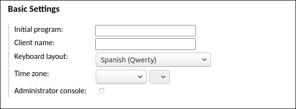

[TOC]

# Access guide

Here we gather a collection of how-to notes with the aim of helping users to self-manage their virtual machines.

## SSH access

SSH access into virtual machines is only allowed via public-key authentication.

### Create your own public SSH key

For general information about how SSH authentication works, please visit:

[https://www.ssh.com/ssh/key/](https://www.ssh.com/ssh/key/)

If you have already created a public SSH key on your computer, it should be available in:

```
# list your SSH keys
ls -al $HOME/.ssh
```

If the command above works, you just need to check whether your SSH key is loaded with:

```
# check whether your SSH keys are loaded
ssh-add -L
```

That should print out all the SSH public keys that are already loaded in you terminal
so just pick one to configure your SSH access to the virtual machine.

If the `ssh-add -L` command did not return any output, please execute `ssh-add` or 
`ssh-add ./path/to/private/key/` to load it. More information
[here](https://www.ssh.com/ssh/agent#adding-ssh-keys-to-the-agent).

Please note that both **private** and **public** SSH keys are located in the `$HOME/.ssh` folder.
Public keys are usually stored in files ending with the ``.pub`` extension. If you have one,
you can either email it to us via ``ska-itsupport`` 'at' ``iaa.csic.es`` or follow steps in the next
section to configure SSH access yourself via Guacamole.

!!! warning
    Please make sure you only share public SSH (files ending in .pub) with others.

If the `ls -al $HOME/.ssh` command above fails, it is very likely that you haven not configured
SSH keys yet. To do so please use the `ssh-keygen` command:

```
# create a new SSH key pair
ssh-keygen
```

Follow instructions on your terminal and for more information please visit:

[https://www.ssh.com/ssh/keygen/](https://www.ssh.com/ssh/keygen/)

If all went well you should have a new file ending in ``.pub``under the `$HOME/.ssh` folder.
Then, feel free to email us a copy of your ``.pub`` file to ``ska-itsupport`` 'at' ``iaa.csic.es``
so we configure your SSH access or follow steps in the next section if you have access to Guacamole.

### Add your public SSH key to access your virtual machine

If you have access to the virtual machine via [Guacamole](#remote-desktop-guacamole) then you can
add your public SSH key to your account yourself. Please open a terminal and try these steps:

```
# go to your home folder
cd

# create an .ssh folder if it doesn't exist
mkdir -p .ssh

# configure permissions
chmod 0700 -R .ssh

# now cd into the .ssh folder
cd .ssh

# create an authorized file and add your public SSH key
vi authorized_keys

# configure permissions
chmod 0600 authorized_keys
```

You should now be able to login with your SSH keypair. If you have problems, please send your
public key to ``ska-itsupport`` 'at' ``iaa.csic.es`` and we will configure SSH access for you.


## Remote desktop

It is possible to access to you virtual machine through a remote desktop. 

- Install an RDP client on your computer. If you use Mac you can download <a href="https://apps.apple.com/us/app/microsoft-remote-desktop/id1295203466">Microsoft Remote Desktop</a>, for Linux, you can use <a href="https://remmina.org/">Remmina</a>
- Indicate in Host/Server and port 18020
<BR>


- You can add your Linux credentials to the connection configuration. If you leave them empty, you will be requested to enter them when you start the connection
<BR>


## Web-based remote desktop

When a project requires access to a remote desktop we preconfigure virtual machines with
[Apache Guacamole](https://guacamole.apache.org).

### Working with the clipboard in Guacamole

Using the clipboard in Guacamole is not intuitive. If you are planning to use the clipboard a lot,
and the information you are going to work with is available online (i.e. via a web browser), we then
recommend you to open firefox to copy/paste as usual inside the virtual machine.

If, on the other hand, you need to copy/paste between your workstation and the virtual machine, then
you will have to use the Guacamole menu. On the tab where you have Guacamole working, press **Ctrl+Alt+Shift** 
and the menu appears on the left:


You will see the Guacamole clipboard that will be used as an intermediate buffer between your workstation
and the virtual machine:

* Copy/paste from your workstation to the virtual machine: 1) first copy the text into the clipboard
as usual in your workstation; 2) open the Guacamole menu with **Ctrl+Alt+Shift** and paste your text
into the Guacamole clipboard; 3) the text is now available inside the virtual machine clipboard and
you can paste it as expected with **Ctrl+V**

* Copy/paste from the virtual machine to your workstation: 1) use **Ctrl+C** inside the virtual machine
to copy text as usual; 2) open the Guacamole menu with **Ctrl+Alt+Shift** and copied text automatically
appears in the Guacamole clipboard; 3) you can now copy from there into your workstation's clipboard.

### How to change your password in Guacamole

Press **Ctrl+Alt+Shift** to open the Guacamole menu, first click on your username (**spsrc** on the
example image) and then on **Settings**:


Then go to **Preferences** and follow instructions to change your password:


### How to add a new user in Guacamole

Go to the menu on the top-right and click on **Settings**:


Then go to **Users** and click on **New User**:


Enter a username and password for the new user:


Scroll down and check the following and click on **Save**:

* Permissions/Change own password
* Connections/RDP


### How to change your locale in Guacamole

Depending on your system's [locale](https://en.wikipedia.org/wiki/Locale_(computer_software))
you may find issues while typing text inside the virtual machine via Guacamole. Check
whether you have the correct configuration in Guacamole by following the steps below.

Go to the menu on the top-right and click on **Settings**:


Then go to **Connections** and click on **RDP**:


Now look for the **Basic Settings** section and choose the correct **keyboard layout**:



Do not forget to scroll down and click on **Save**.

## User management with Linux 

By default, when a VM is created we will create an account for the PI of the project. PIs can choose to create new accounts for their collaborators.

### Change your default password

Run the following command on a terminal and follow instructions:
```
passwd
```

### Create a user account

Open a terminal and run the following commands. When you enter the ```openssl``` command below, you have to enter twice the password for the new user. 
The hash code will only be used in the ```useradd``` command, and you don't need to keep it. 
```
# Generate a new password hash:
openssl passwd

# Create a new account:
sudo useradd --password "<output-from-previous-command>" --gid spsrc-group --create-home --shell /bin/bash <collaborator>
```
For example:
```
# Create a new account:
sudo useradd --password "<output-from-previous-command>" --gid spsrc-group --create-home --shell /bin/bash john
```

!!! info
    Please configure a password with less than 8 characters. We have experimented issues with longer passwords.
    
### Delete a user account

You can delete a user account using the userdel command:
```
sudo userdel <collaborator> --remove
```
For example:
```
sudo userdel john --remove
```

    
## Data transfer

We suggest using [FileZilla](https://filezilla-project.org/download.php?type=client) to transfer data
in and out of the virtual machine.

Transfers will only be possible via public SSH authentication. Here are instructions on how to
configure FileZilla to work with SSH keys: 

[https://wiki.filezilla-project.org/Howto](https://wiki.filezilla-project.org/Howto)

Please send your public SSH key to ``ska-itsupport`` 'at' ``iaa.csic.es`` so we can configure it for you.
