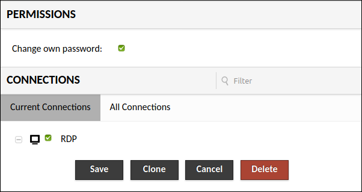

[TOC]

# How-to guide

Here we gather a collection of how-to notes with the aim of helping users to self-manage their virtual machines.

## User management

Initially there is only one preconfigured user account on the virtual machine, the **spsrc** user,
with privileges to create new accounts for your collaborators.

### Change your default password

Run the following command on a terminal and follow instructions:
```
passwd
```

### Create a user account

Open a terminal and run the following commands. When you enter the first command, you will have to enter the password that the new user will have. Once you enter the new password and verify it, the command will show a code. You have to use the code to generate the new user:

```
# Generate a new password hash:
openssl passwd

# Create a new account:
sudo useradd --password "<output-from-previous-command>" --gid spsrc-group --create-home --shell /bin/bash <collaborator>
```
For example, imagine you want to create the user `john` and set a password for this user `acomlpicatedpass`. You can do:
```
openssl passwd
Password:                 <--- write acomplicatedpass
Verifying - Password:     <--- write acomplicatedpass
7TRPLSzGYvTf4

sudo useradd --password 7TRPLSzGYvTf4 --gid spsrc-group --create-home --shell /bin/bash john
```

!!! info
    Please configure a password with less than 8 characters. We have experimented issues with longer passwords.

### Delete a user account

You can delete a user account using the userdel command:
```
sudo userdel <collaborator> --remove
```
For example:
```
sudo userdel john --remove
```

## Software installation

All users are granted with ``sudo`` privileges to use the operating system package manager
(i.e. ``apt-get`` in Ubuntu, and ``yum/dnf`` in Centos7/8) to install packages via the official
repositories. 

## SSH access

SSH access into virtual machines is only allowed via public-key authentication.

### Create your own public SSH key

For general information about how SSH authentication works, please visit:

[https://www.ssh.com/ssh/key/](https://www.ssh.com/ssh/key/)

If you have already created a public SSH key on your computer, it should be available in:

```
# list your SSH keys
ls -al $HOME/.ssh
```

If the command above works, you just need to check whether your SSH key is loaded with:

```
# check whether your SSH keys are loaded
ssh-add -L
```

That should print out all the SSH public keys that are already loaded in you terminal
so just pick one to configure your SSH access to the virtual machine.

If the `ssh-add -L` command did not return any output, please execute `ssh-add` or 
`ssh-add ./path/to/private/key/` to load it. More information
[here](https://www.ssh.com/ssh/agent#adding-ssh-keys-to-the-agent).

Please note that both **private** and **public** SSH keys are located in the `$HOME/.ssh` folder.
Public keys are usually stored in files ending with the ``.pub`` extension. If you have one,
you can either email it to us via ``ska-itsupport`` 'at' ``iaa.csic.es`` or follow steps in the next
section to configure SSH access yourself via Guacamole.

!!! warning
    Please make sure you only share public SSH (files ending in .pub) with others.

If the `ls -al $HOME/.ssh` command above fails, it is very likely that you haven not configured
SSH keys yet. To do so please use the `ssh-keygen` command:

```
# create a new SSH key pair
ssh-keygen
```

Follow instructions on your terminal and for more information please visit:

[https://www.ssh.com/ssh/keygen/](https://www.ssh.com/ssh/keygen/)

If all went well you should have a new file ending in ``.pub``under the `$HOME/.ssh` folder.
Then, feel free to email us a copy of your ``.pub`` file to ``ska-itsupport`` 'at' ``iaa.csic.es``
so we configure your SSH access or follow steps in the next section if you have access to Guacamole.

### Add your public SSH key to access your virtual machine

If you have access to the virtual machine via [Guacamole](#remote-desktop-guacamole) then you can
add your public SSH key to your account yourself. Please open a terminal and try these steps:

```
# go to your home folder
cd

# create an .ssh folder if it doesn't exist
mkdir -p .ssh

# configure permissions
chmod 0700 -R .ssh

# now cd into the .ssh folder
cd .ssh

# create an authorized file and add your public SSH key
vi authorized_keys

# configure permissions
chmod 0600 authorized_keys
```

You should now be able to login with your SSH keypair. If you have problems, please send your
public key to ``ska-itsupport`` 'at' ``iaa.csic.es`` and we will configure SSH access for you.

## Transfer data

We suggest using [FileZilla](https://filezilla-project.org/download.php?type=client) to transfer data
in and out of the virtual machine.

Transfers will only be possible via public SSH authentication. Here are instructions on how to
configure FileZilla to work with SSH keys: 

[https://wiki.filezilla-project.org/Howto](https://wiki.filezilla-project.org/Howto)

Please send your public SSH key to ``ska-itsupport`` 'at' ``iaa.csic.es`` so we can configure it for you.

## Remote desktop: Guacamole

When a project requires access to a remote desktop we preconfigure virtual machines with
[Apache Guacamole](https://guacamole.apache.org).

### Working with the clipboard in Guacamole

Using the clipboard in Guacamole is not intuitive. If you are planning to use the clipboard a lot,
and the information you are going to work with is available online (i.e. via a web browser), we then
recommend you to open firefox to copy/paste as usual inside the virtual machine.

If, on the other hand, you need to copy/paste between your workstation and the virtual machine, then
you will have to use the Guacamole menu. On the tab where you have Guacamole working, press **Ctrl+Alt+Shift** 
and the menu appears on the left:


You will see the Guacamole clipboard that will be used as an intermediate buffer between your workstation
and the virtual machine:

* Copy/paste from your workstation to the virtual machine: 1) first copy the text into the clipboard
as usual in your workstation; 2) open the Guacamole menu with **Ctrl+Alt+Shift** and paste your text
into the Guacamole clipboard; 3) the text is now available inside the virtual machine clipboard and
you can paste it as expected with **Ctrl+V**

* Copy/paste from the virtual machine to your workstation: 1) use **Ctrl+C** inside the virtual machine
to copy text as usual; 2) open the Guacamole menu with **Ctrl+Alt+Shift** and copied text automatically
appears in the Guacamole clipboard; 3) you can now copy from there into your workstation's clipboard.

### How to change your password in Guacamole

Press **Ctrl+Alt+Shift** to open the Guacamole menu, first click on your username (**spsrc** on the
example image) and then on **Settings**:


Then go to **Preferences** and follow instructions to change your password:


### How to add a new user in Guacamole

Go to the menu on the top-right and click on **Settings**:


Then go to **Users** and click on **New User**:


Enter a username and password for the new user:


Scroll down and check the following and click on **Save**:

* Permissions/Change own password
* Connections/RDP



### How to change your locale in Guacamole

Depending on your system's [locale](https://en.wikipedia.org/wiki/Locale_(computer_software))
you may find issues while typing text inside the virtual machine via Guacamole. Check
whether you have the correct configuration in Guacamole by following the steps below.

Go to the menu on the top-right and click on **Settings**:


Then go to **Connections** and click on **RDP**:


Now look for the **Basic Settings** section and choose the correct **keyboard layout**:


Do not forget to scroll down and click on **Save**.

## Conda

[Conda](https://conda.io) is a package manager that help you find and install software
packages without having administrator privileges.

Below are the steps to get a basic conda installation working with Python 3. Open
a terminal on your virtual machine and run the following commands:

```
# Go to a working directory to install conda
mkdir test
cd test

# Download installer
curl -O https://repo.anaconda.com/miniconda/Miniconda3-latest-Linux-x86_64.sh

# Install conda in the "conda-install" folder
bash Miniconda3-latest-Linux-x86_64.sh -b -p conda-install

# Activate conda
source conda-install/etc/profile.d/conda.sh

# Create a basic environment with the latest Python 3
conda create -n py3env python=3

# Activate the "py3env":
conda activate py3env

# check it with
which python
python --version

# "pip" is also available:
which pip

# To leave the environment, type:
conda deactivate
```
Conda environments are great for managing the dependencies on your projects
and it helps you improve the reproducibility of your code. For more information
about conda, please visit: [Getting started with Conda](https://docs.conda.io/projects/conda/en/latest/user-guide/getting-started.html).


### Install JupyterLab with Conda

Here we describe the steps to install JupyterLab into its own conda environment:

```
# Follow steps above to install conda.
# Then create a conda environment for JupyterLab:
conda create -n jupyterlab -c conda-forge jupyterlab -y
conda activate jupyterlab
jupyter lab --ip=0.0.0.0 --port=<port-number>
```
JupyterLab will print out the URL to connect to your session.

## Singularity Containers 

Containers are unit software packages that contain all the software, files, libraries, dependencies and environmental variables necessary to run a particular task or workflow. Containers are encapsulated software environments and abstract the software and applications from the underlying operating system. This allows users to run workflows in customized environments, switch between environments, and to share these environments with colleagues and research teams.

Images are the files used to generate containers. Container images become containers at runtime. Containers are then identical copies instantiated from images.

Container images can be found at /spsrc/software/containers/ and are maintained by the support team. 

Singularity is a open-source sotfware that performs containerization. 

### Singularity shell 

Users can open a Singularity container as an interactive shell and issue command line tasks within the environment that the container provides. 

Here we will see an example of how to call the Singualrity container using the shell command to work with CASA: 

```bash  

spsrc@spi-kat-project-007:~$ singularity shell /spsrc/software/containers/casa_stable_5.7.2-4.sif 

spsrc@casa_stable_5.7.2-4.sif:~$ casa --nogui

=========================================
The start-up time of CASA may vary
depending on whether the shared libraries
are cached or not.
=========================================

IPython 5.1.0 -- An enhanced Interactive Python.

CASA 5.7.2-4   -- Common Astronomy Software Applications

Creating a new telemetry file
Telemetry initialized. Telemetry will send anonymized usage statistics to NRAO.
You can disable telemetry by adding the following line to your ~/.casarc file:
EnableTelemetry: False
--> CrashReporter initialized.
Enter doc('start') for help getting started with CASA...
Using matplotlib backend: TkAgg

CASA <1>:

``` 
You are ready to use CASA interactively! 


### Singularity exec

A user is able to execute a script or command within the container environment using the singularity ```exec``` command.

Here we will see an example with common linux commands but you can use any script or software available in the Singularity Image instead.  

```
$ singularity exec /spsrc/software/containers/casa_stable_5.7.2-4.sif date
Fri May  7 16:23:10 UTC
$ singularity exec /spsrc/software/containers/casa_stable_5.7.2-4.sif echo hello
hello
```
This is an example of how to execute CASA: 
```
singularity exec /spsrc/software/containers/casa_stable_5.7.2-4.sif casa
```


### Additional parameters

The following parameters can be use in each of the executions mentioned above. 

To clean the environment before running the container:
```bash
--cleanenv
```
To specify a home directory inside the container. Use `$PWD` to select your current directory or specify any directory inside the container (it does not need to exist):
```bash
--home $PWD
```
To bind a local directory with a directory inside the container. In this example we will bind the directory `localdata` in the host to the directory `containerdata` in the container:
```bash
--bind localdata:containerdata
```

### Examples of `--bind` option to access a local folder from inside the container 

Add the parameter --bind <localfolder>:<containerfolder> to the singularity command:
    
```bash
singularity shell --bind localfolder:containerfolder --cleanenv --home $PWD /spsrc/software/containers/<image_name>
```

Example with shell interaction and sharing folders:
```bash
singularity shell --bind /home/user/data:/mycontainerfolder --cleanenv --home $PWD /spsrc/software/containers/casa_1.7.0.sif
```
Now,  inside the container, if you use the list command 
```bash
ls -l /mycontainerfolder
```
you will see you files of your local storage folder in `/home/user/data`.

Now an example with execution mode and sharing folders:
```bash
singularity exec --bind /home/user/data:/mycontainerfolder --cleanenv --home $PWD /spsrc/software/containers/casa_1.7.0.sif python /mycontainerfolder/myscript.py
```
You will execute `python /mycontainerfolder/myscript.py` that corresponds to the execution of the script located in your machine in `/home/user/data/`. Note that you are calling/running the script `myscript.py` from inside the container, so the paths are related to the container.

