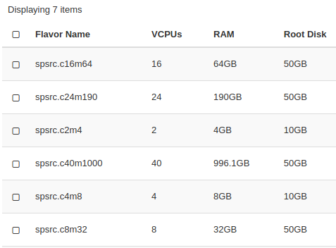

# Technical specifications 

The protoSRC computing facility at the IAA-CSIC is an OpenStack cloud platform.   
 
## Virtual machine flavours 
The protoSRC provides seven ad-hoc flavors for virtual machines. Users can request the one more suitable for them.   

The SDC2 participants can choose between the following two flavours: 

spsrc.c8m32
8 vCPU cores
32 GB RAM
50 GB disk

spsrc.c16m64
16 vCPU cores
64 GB RAM
50 GB disk

## Software installed

The protoSRC provides the following base images for virtual machines from which users can request the most suitable for them:
- Ubuntu 18.04
- CentOS 8
Users with sudo access will be able to install their own software. 

