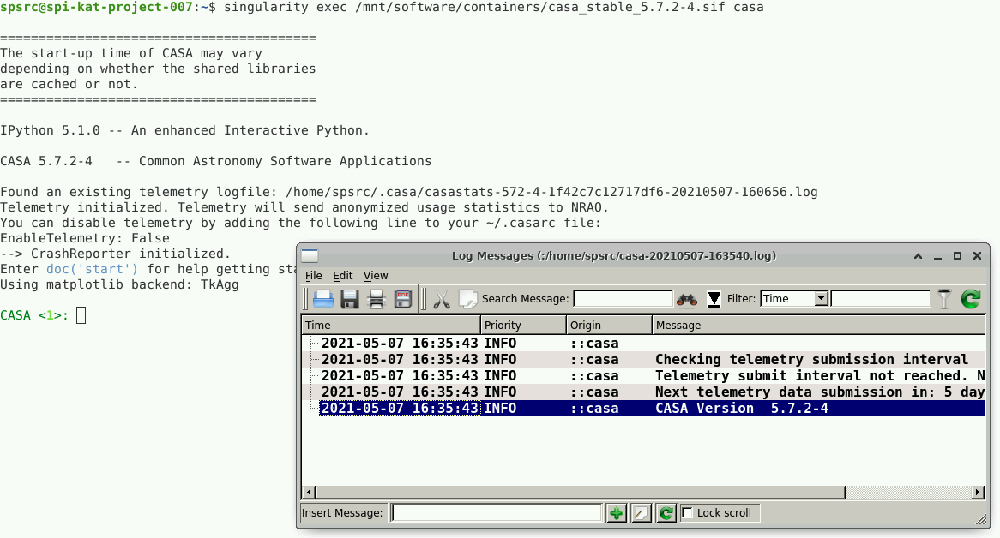

[TOC]

# User Guide 

## Software installation

All users are granted with ``sudo`` privileges to use the operating system package manager
(i.e. ``apt-get`` in Ubuntu, and ``yum/dnf`` in Centos7/8) to install packages via the official
repositories. 

## Conda

[Conda](https://conda.io) is a package manager that help you find and install software
packages without having administrator privileges.

Below are the steps to get a basic conda installation working with Python 3. Open
a terminal on your virtual machine and run the following commands:

```
# Go to a working directory to install conda
mkdir test
cd test

# Download installer
curl -O https://repo.anaconda.com/miniconda/Miniconda3-latest-Linux-x86_64.sh

# Install conda in the "conda-install" folder
bash Miniconda3-latest-Linux-x86_64.sh -b -p conda-install

# Activate conda
source conda-install/etc/profile.d/conda.sh

# Create a basic environment with the latest Python 3
conda create -n py3env python=3

# Activate the "py3env":
conda activate py3env

# check it with
which python
python --version

# "pip" is also available:
which pip

# To leave the environment, type:
conda deactivate
```
Conda environments are great for managing the dependencies on your projects
and it helps you improve the reproducibility of your code. For more information
about conda, please visit: [Getting started with Conda](https://docs.conda.io/projects/conda/en/latest/user-guide/getting-started.html).


### Install JupyterLab with Conda

Here we describe the steps to install JupyterLab into its own conda environment:

```
# Follow steps above to install conda.
# Then create a conda environment for JupyterLab:
conda create -n jupyterlab -c conda-forge jupyterlab -y
conda activate jupyterlab
jupyter lab --ip=0.0.0.0 --port=<port-number>
```
JupyterLab will print out the URL to connect to your session.

## Singularity hub

Containers are unit software packages that contain all the software, files, libraries, dependencies and environmental variables necessary to run a particular task or workflow. Containers are encapsulated software environments and abstract the software and applications from the underlying operating system. This allows users to run workflows in customized environments, switch between environments, and to share these environments with colleagues and research teams.

Images are the files used to generate containers. Container images become containers at runtime. Containers are then identical copies instantiated from images.

Container images can be found at /mnt/software/containers/ and are maintained by the support team. 

Singularity is a open-source sotfware that performs containerization. 

### Singularity shell 

Users can open a Singularity container as an interactive shell and issue command line tasks within the environment that the container provides. 

Here we will see an example of how to call the Singualrity container using the shell command to work with CASA: 

```bash  

spsrc@spi-kat-project-007:~$ singularity shell /mnt/software/containers/casa_stable_5.7.2-4.sif 

spsrc@casa_stable_5.7.2-4.sif:~$ casa --nogui

=========================================
The start-up time of CASA may vary
depending on whether the shared libraries
are cached or not.
=========================================

IPython 5.1.0 -- An enhanced Interactive Python.

CASA 5.7.2-4   -- Common Astronomy Software Applications

Creating a new telemetry file
Telemetry initialized. Telemetry will send anonymized usage statistics to NRAO.
You can disable telemetry by adding the following line to your ~/.casarc file:
EnableTelemetry: False
--> CrashReporter initialized.
Enter doc('start') for help getting started with CASA...
Using matplotlib backend: TkAgg

CASA <1>:

``` 
You are ready to use CASA interactively! 


### Singularity exec

A user is able to execute a script or command within the container environment using the singularity ```exec``` command.

Here we will see an example with common linux commands but you can use any script or software available in the Singularity Image instead.  

```
$ singularity exec /mnt/software/containers/casa_stable_5.7.2-4.sif date
Fri May  7 16:23:10 UTC
$ singularity exec /mnt/software/containers/casa_stable_5.7.2-4.sif echo hello
hello
```
This is an example of how to execute CASA: 
```
singularity exec /mnt/software/containers/casa_stable_5.7.2-4.sif casa
```


### Additional parameters

The following parameters can be use in each of the executions mentioned above. 

To clean the environment before running the container:
```bash
--cleanenv
```
To specify a home directory inside the container. Use `$PWD` to select your current directory or specify any directory inside the container (it does not need to exist):
```bash
--home $PWD
```
To bind a local directory with a directory inside the container. In this example we will bind the directory `localdata` in the host to the directory `containerdata` in the container:
```bash
--bind localdata:containerdata
```

### Examples of `--bind` option to access a local folder from inside the container 

Add the parameter --bind <localfolder>:<containerfolder> to the singularity command:
    
```bash
singularity shell --bind localfolder:containerfolder --cleanenv --home $PWD /mnt/software/containers/<image_name>
```

Example with shell interaction and sharing folders:
```bash
singularity shell --bind /home/user/data:/mycontainerfolder --cleanenv --home $PWD /mnt/software/containers/casa_1.7.0.sif
```
Now,  inside the container, if you use the list command 
```bash
ls -l /mycontainerfolder
```
you will see you files of your local storage folder in `/home/user/data`.

Now an example with execution mode and sharing folders:
```bash
singularity exec --bind /home/user/data:/mycontainerfolder --cleanenv --home $PWD /mnt/software/containers/casa_1.7.0.sif python /mycontainerfolder/myscript.py
```
You will execute `python /mycontainerfolder/myscript.py` that corresponds to the execution of the script located in your machine in `/home/user/data/`. Note that you are calling/running the script `myscript.py` from inside the container, so the paths are related to the container.

## Build your own Singularity containers

If you want to build your own containers with Sigularity, please use your mass storage space (usually ```/mnt/scratch/```) of your Virtual Machine. We recommend that you follow this instructions before building or pulling new containers. 
    
Create the directories that will be used by Singularity to store transient files:

 ```
 mkdir -p /mnt/scratch/user_containers/.singularity_cache
 mkdir -p /mnt/scratch/user_containers/.singularity_cache/tmp
 mkdir -p /mnt/scratch/user_containers/.singularity_cache/localcache
 mkdir -p /mnt/scratch/user_containers/.singularity_cache/pull
 ```

and then you must add the following environment variables to your ```.bashrc``` file. To do this type ``nano $HOME/.bashrc`` , move to the end of the file and add the following:

 ```
 export SINGULARITY_CACHEDIR=/mnt/software/user_containers/.singularity_cache
 export SINGULARITY_TMPDIR=$$SINGULARITY_CACHEDIR/tmp
 export SINGULARITY_LOCALCACHEDIR=$SINGULARITY_CACHEDIR/localcache
 export SINGULARITY_PULLFOLDER=$SINGULARITY_CACHEDIR/pull
 ```

Save the file, and run ```source $HOME/.bashrc```.
    
If you don't have a Block Storage assigned (the path `/mnt/scratch/` does not exist), contact the administrators.

    
    
    
